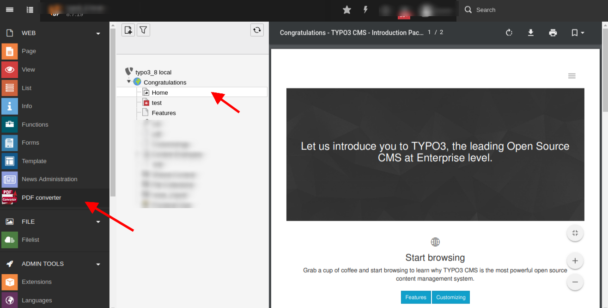

.. ==================================================
.. FOR YOUR INFORMATION
.. --------------------------------------------------
.. -*- coding: utf-8 -*- with BOM.

.. include:: ../Includes.txt

.. _users-manual:

Users manual
============

Installation
---------------
* You can install the extension using extension manager.
* Once installed ,there appears a pdf_converter back end module within  web tab.

Requirements
-------------------
* Typo3 8.7 to  9.5.0

User interface
---------------

* By selecting the module and the required page for pdf conversion you will get your page converted to pdf.
* Downloaded pdf will be saved to the path: ext/pdf_converter/Private/Downloads/report.pdf